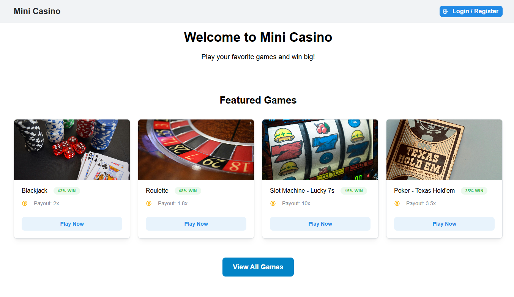
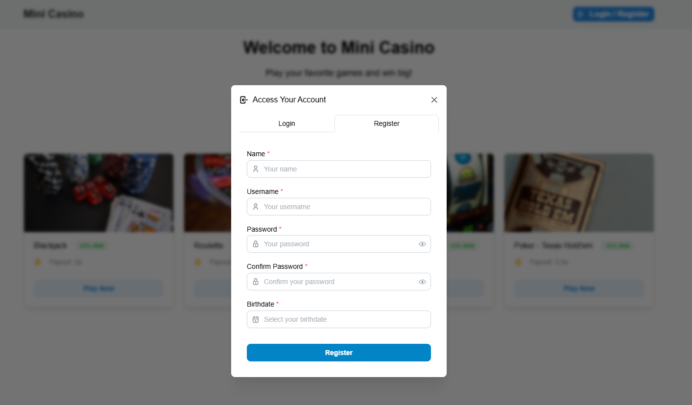
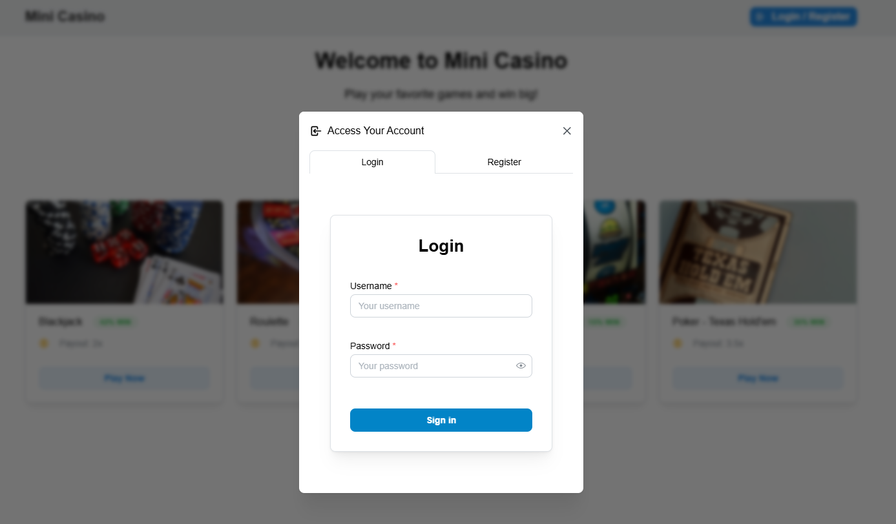
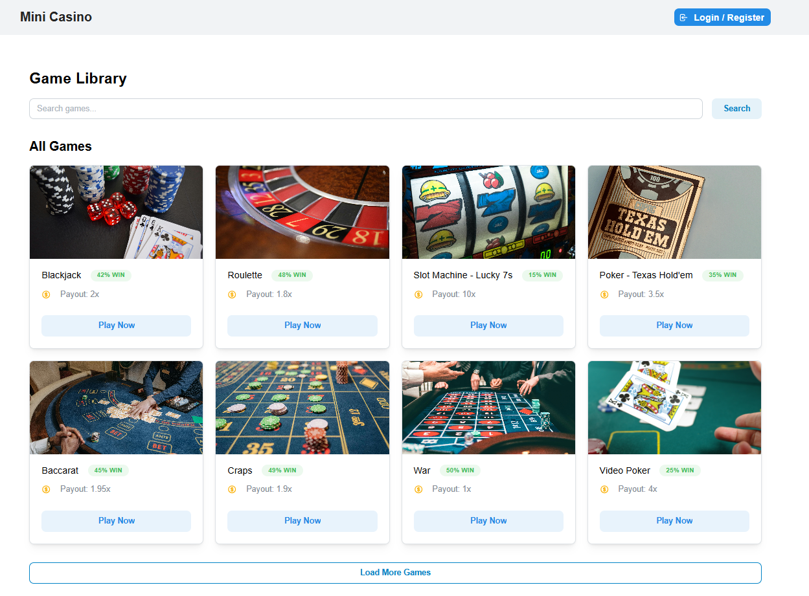
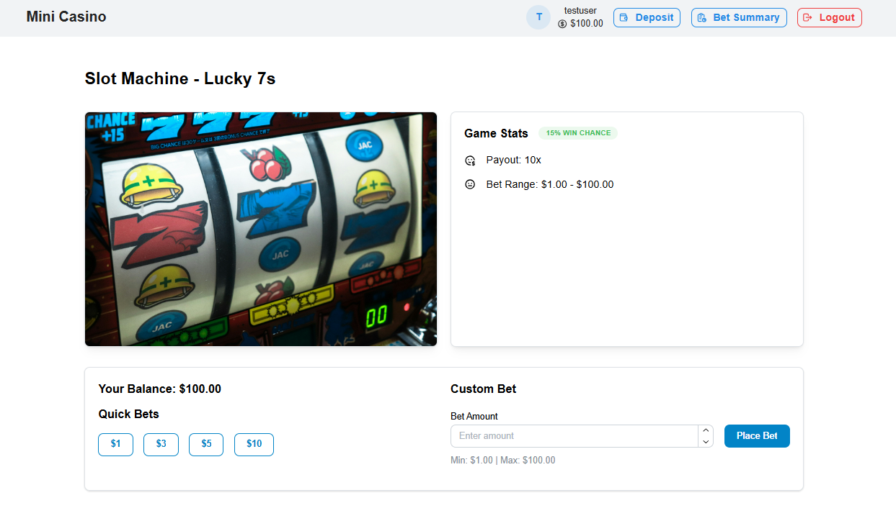
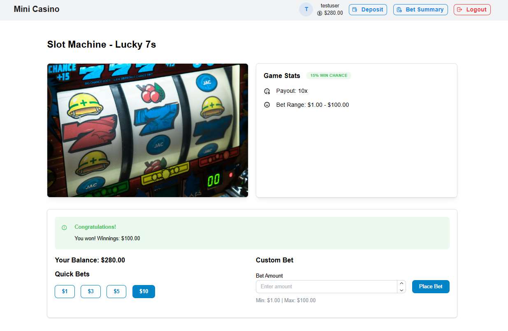
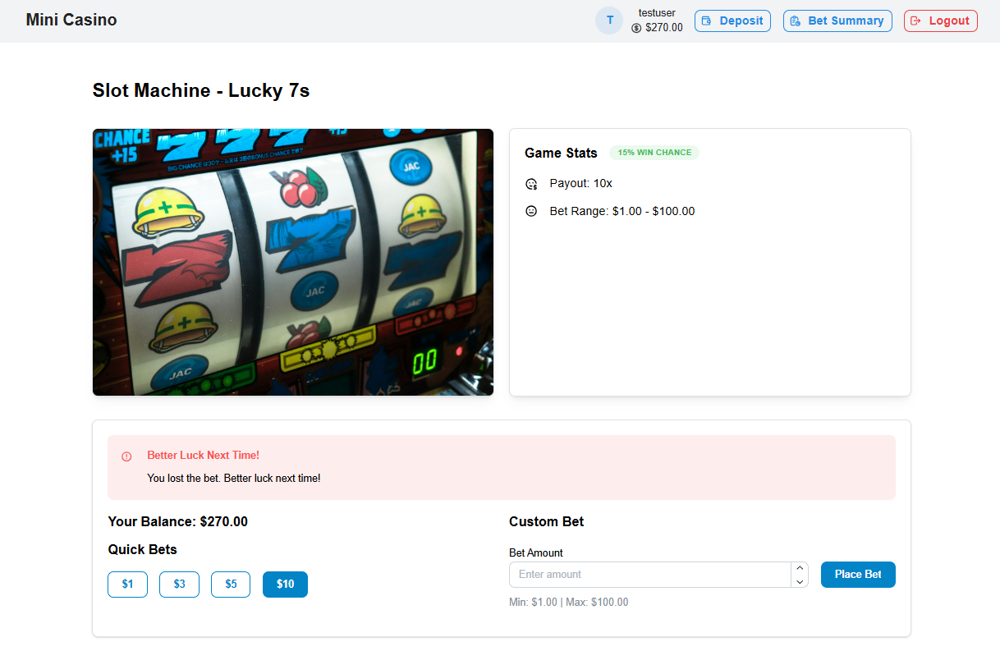
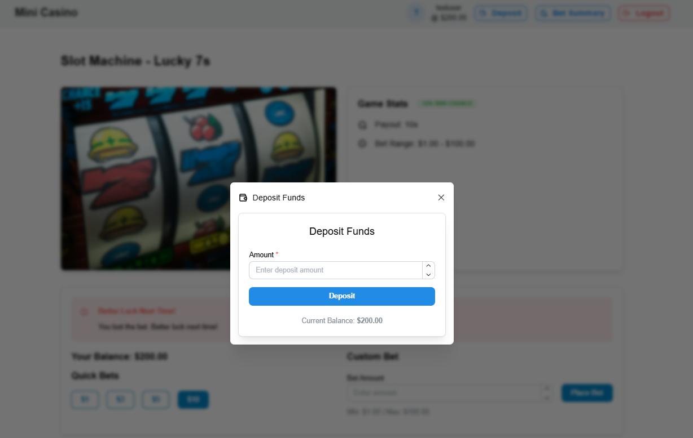
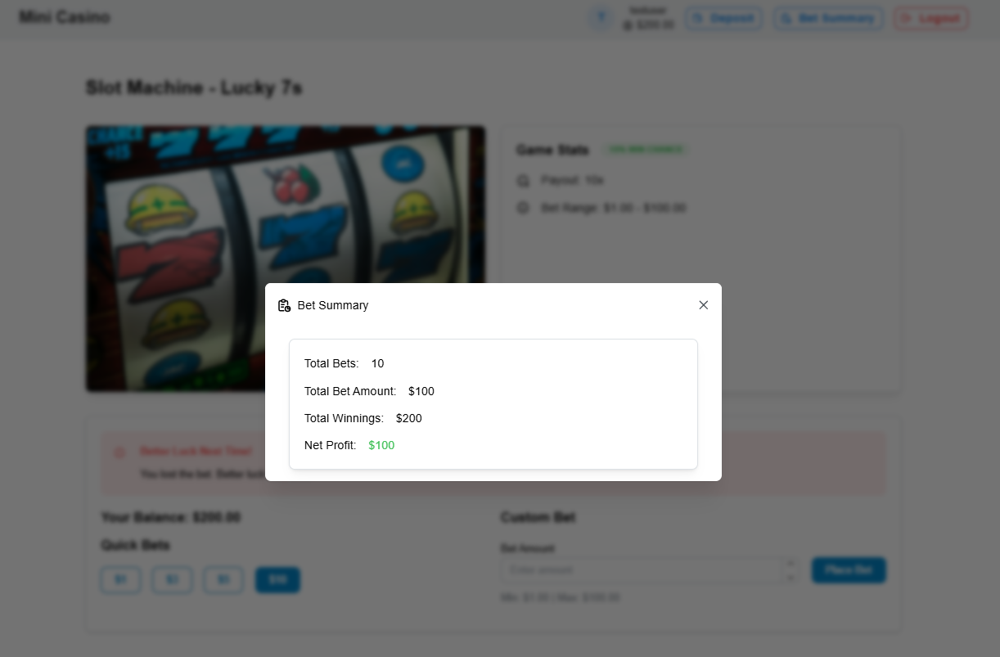

# Mini Casino Frontend

This is the frontend of the **Mini Casino** platform, built using **React**. It provides a user-friendly interface for players to interact with various casino games, manage their profiles, and place bets. The frontend communicates with the backend API to enable features like player registration, authentication, depositing funds, and playing casino games.


## Table of Contents

- [Features](#features)
- [Technology Stack](#technology-stack)
- [Installation and Setup](#installation-and-setup)
  - [Prerequisites](#prerequisites)
  - [Installation](#installation)
  - [Running the Application](#running-the-application)
  - [Building for Production](#building-for-production)
- [Screenshots](#screenshots)

## Features

- **User Authentication**: Register, login, and manage user sessions securely.
- **Deposit Funds**: Deposit funds into the player’s account to place bets.
- **View and Play Games**: Browse and play casino games such as Blackjack and Roulette.
- **Balance Overview**: Check your account balance and view betting history.

## Technology Stack

- **Frontend**: React.js
- **State Management**: Redux
- **Routing**: React Router
- **API Communication**: Axios or Fetch for API requests
- **Styling**: Mantine

## Installation and Setup

### Prerequisites

Before you begin, ensure you have the following installed on your system:

- **Node.js** (v14 or higher)
- **npm** (v6 or higher)

### Installation

1. Clone the repository to your local machine:

   ```bash
   git clone https://github.com/QI-D/mini-casino-frontend.git
   cd mini-casino-frontend

   ```

2. Install the required dependencies:
   ```bash
   npm install
   ```

### Running the Application

```bash
npm start
```

Then open `http://localhost:3000` in your browser.

### Building for Production

```bash
npm run build
```

This generates optimized static files in the `build` directory.

## Screenshots

### Home Page



### Auth Modal

#### Register



#### Login



### Games Page



### Game Page



### Game Result

#### Won



#### Lost



### Deposit



### Bet Summary


